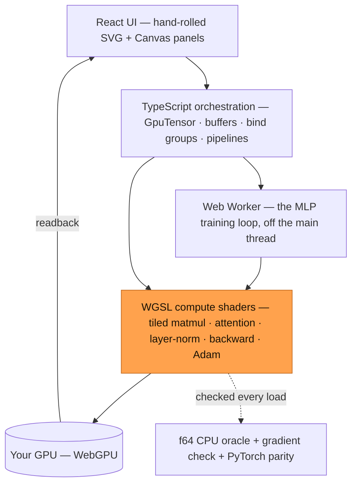
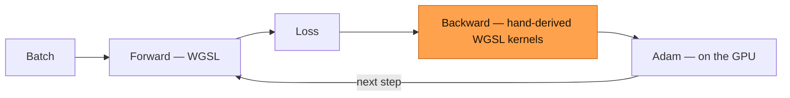

<div align="center">

# gradient

### Watch a neural network learn — every FLOP a GPU shader, in a browser tab.

A from-scratch deep-learning stack that trains **entirely on your GPU, in the browser** — no Python, no server, no WASM. The forward pass, the hand-derived backward pass, and the optimizer are all WebGPU compute shaders (WGSL) dispatched from TypeScript. Open the page and watch an MLP learn MNIST and a transformer learn to write — live, on your own graphics card.

[](https://santoshcheethiralame-dot.github.io/GRADIENT/)


[Live Demo](https://santoshcheethiralame-dot.github.io/GRADIENT/) · [Quickstart](#quickstart) · [Architecture](#architecture) · [The chapters](#the-chapters) · [Design notes](#how-its-built-design-notes) · [Report a bug](https://github.com/santoshcheethiralame-dot/GRADIENT/issues)

</div>

<!-- Hero shot goes here — a 15–25s GIF is ideal: the CPU-vs-GPU race pulling
     away, or the attention matrix sharpening from noise into structure.
      -->

---

## The "aha"

Training a neural network usually means Python, CUDA, and a lot of trust — you call `loss.backward()` and believe the gradients are right.

gradient throws that out. It rebuilds the whole stack from the metal up — the forward pass, the **hand-derived backward pass**, and the optimizer — as **WebGPU compute shaders**, and trains a from-scratch transformer live in a browser tab. Paste in a sentence and its output crawls from noise into your words as the loss falls and the attention matrix sharpens.

Then it proves it's right. Every kernel is diffed against an **f64 CPU oracle** and against **PyTorch** on every page load: **51/51 checks pass, agreeing to ~1e-7.**

No Python. No server. No trust required. **[try it →](https://santoshcheethiralame-dot.github.io/GRADIENT/)**

---

## Highlights

- **Watch it learn** — a 2-layer MLP reaches ~97% on MNIST and a from-scratch nano-GPT learns to write, both live at 60fps, streaming loss curves, activations, and generations.
- **Everything on the GPU** — matmul, attention, layer-norm, the full backward pass, and Adam are all WGSL compute shaders; nothing touches Python or a server.
- **Hand-derived backprop, verified** — the transformer's backward pass is derived by hand and checked three independent ways (f64 oracle, finite-difference gradient check, PyTorch parity) on every load.
- **Race the CPU** — the exact same transformer trained two ways at once, one CPU thread vs. your GPU, side by side, on a live loss-vs-wall-clock chart.
- **See the *backward* pass** — most demos visualize attention (the forward pass); gradient shows the gradients flowing back through every layer, where the learning happens.
- **A real transformer** — multi-head attention, stacked blocks, and a byte-pair tokenizer, all ported to the GPU and gradient-checked.
- **Runs anywhere** — GPU via WebGPU; no WebGPU and an f64 CPU engine (the same one used as the correctness oracle) takes over automatically.
- **No black-box charts** — every visualization is hand-rolled inline SVG / Canvas.

---

## Table of contents

[The "aha"](#the-aha) · [Highlights](#highlights) · [Architecture](#architecture) · [Quickstart](#quickstart) · [The chapters](#the-chapters) · [What it proves](#what-it-proves) · [Models](#models) · [Design notes](#how-its-built-design-notes) · [Roadmap](#roadmap) · [Contributing](#contributing) · [License](#license)

---

## Architecture

There is no backend. gradient is a static site — a Vite-built React bundle that dispatches WebGPU compute shaders straight from the browser. The "server" is your GPU.



The signature move is that the **entire training step — including the backward pass — runs on the GPU**:



---

## Quickstart

**Easiest:** open the **[live demo](https://santoshcheethiralame-dot.github.io/GRADIENT/)** — it boots, runs its kernel self-test, and starts training in your browser, no signup.

**Run locally:**

```bash
git clone https://github.com/santoshcheethiralame-dot/GRADIENT.git
cd GRADIENT
npm install
npm run dev          # → http://localhost:5173
```

Open the URL — the app boots, runs its **51/51** kernel self-test, and starts training. The other scripts:

```bash
npm run build        # type-check + production bundle → dist/
npm run preview      # serve the production build locally
```

**Requirements:** [Node.js](https://nodejs.org) 18+ and a WebGPU-capable browser (Chrome / Edge 113+, Safari 18+, or Firefox 141+). No compatible GPU? The app falls back to an f64 CPU engine automatically — or append `?cpu=1` to force it.

**Verify the gradients against PyTorch** (optional, needs `pip install torch`):

```bash
npx tsx verify/export_reference.ts     # dump forward/backward from the TS model
python verify/verify_pytorch.py        # rebuild the same net in PyTorch and diff — agrees to ~1e-7
```

---

## The chapters

The lab is split into two pages that follow the project's two halves. Each chapter is a self-contained, live panel — staged from passive observation, to a real transformer training on the GPU, to a causal CPU-vs-GPU experiment.

**`mlp` — WebGPU from the metal up, and an MLP on MNIST**

| Chapter | What it does |
|---|---|
| **SYS · Device** | The WebGPU adapter and its limits — the machine you're training on. |
| **CH0 · Reference train** | A tiny net learns a synthetic task on load — the "it learns" sanity check, with its loss curve. |
| **CH1 · Live training (MNIST)** | The centerpiece: a live loss/accuracy scope, the input digit + hidden-activation heatmap + softmax bars, a PCA **embedding projector** (watch the digit classes pull apart), a sampled **loss-landscape** surface, and a **draw-a-digit** pad for live GPU inference. |
| **CH3 · Kernel diagnostics** | The self-test table — every GPU kernel diffed against the f64 CPU oracle, per shape, with errors and timing. **51/51 pass.** |
| **CH4 · GPU profiler** | Amortized kernel throughput — naive vs. tiled matmul across sizes, and a full train step — measured over many back-to-back dispatches. |

**`gpt` — a from-scratch nano-GPT, trained on the GPU**

| Chapter | What it does |
|---|---|
| **CH5 · nano-GPT** | A 1-layer char transformer memorizes a sentence and writes it back — the accessible intro, live on the CPU engine. |
| **CH6 · Train on your text** | Paste any corpus; a transformer trains **entirely on the GPU** (forward + backward + Adam in WGSL). Watch the output go from noise to your words and the attention matrix sharpen as the loss falls. |
| **CH7 · CPU vs GPU race** | The exact same model trained two ways at once — one CPU thread (in a Web Worker) vs. your GPU — on a live loss-vs-wall-clock chart. |
| **CH8 · Gradient flow** | The backward pass, visualized: each layer's gradient magnitude, live, from the loss at the LM head back to the embeddings. |
| **CH9 · Scaled** | A 4-head, 128-dim attention block over a 64-token context, trained on the GPU. |
| **CH10 · Deep** | A 2-block, 3-head transformer over a learned **byte-pair-encoding** vocabulary. |

---

## What it proves

Real results, all reproducible in the app:

- **~97% on MNIST**, trained end to end on the GPU in a Web Worker, streaming metrics live.
- **51/51 correctness checks, every load.** Each GPU kernel is diffed against an independent **f64 CPU oracle** at rel. err < 1e-3 (across non-tile-multiple shapes, to exercise boundary masking), the entire backward pass is **numerical-gradient-checked** (analytic vs. central-difference), and — offline — the hand-derived transformer backward is diffed against **PyTorch autograd to ~1e-7**.
- **The GPU laps the CPU.** Same transformer, same weights, one CPU thread vs. your GPU. The speedup is hardware-dependent (roughly **5–20×**) and, honestly, **readback-bound rather than a FLOPs benchmark** — see the design notes.
- **Scaling stays correct.** Multi-head attention, stacked blocks, and BPE are each gradient-checked and **bit-identical when off** (same RNG init order), so the base single-head / single-block path stays verified as the model grows.

---

## Models

| | MLP | nano-GPT |
|---|---|---|
| Task | MNIST digit classification | character / BPE language modeling |
| Shape | 784 → 64 → 10 | up to 2 blocks × 3–4 heads, 96–128 dim, 64-token context |
| Trained | in a Web Worker, on the GPU | on the GPU — forward, backward, and Adam all in WGSL |
| Tokenizer | — | char-level, or a learned byte-pair encoding |
| Result | ~97% test accuracy | learns to write its corpus |

Every new transformer capability defaults **off** and consumes the RNG in the same order as the base model, so a single-head / single-block net is byte-for-byte identical to the verified baseline — and the whole suite is re-checked on every page load.

---

## How it's built (design notes)

A few decisions that aren't obvious from the code:

- **Tiled matmul (16×16 shared memory).** Each value is loaded from slow global memory once per tile and reused 16× from fast workgroup memory; a `workgroupBarrier()` keeps it correct. It's the single biggest kernel win, and the profiler shows it against the naive version live.
- **The backward pass is derived by hand.** The transformer's backward is a chain of small WGSL kernels — attention alone is five (`dV = Aᵀ·dctx`, `dA = dctx·Vᵀ`, the softmax VJP `dS = A ⊙ (dA − rowsum(dA⊙A)) · scale`, `dQ`, `dK`) — plus layer-norm and the MLP. Getting it right to the last decimal is the hard part; PyTorch parity (~1e-7) is how you know.
- **Multi-head attention without per-head weight tensors.** On the GPU, `Wq/Wk/Wv/Wo` stay full `[dE×dE]`; two tiny kernels (`sliceCols` / `pasteCols`) carve each head's columns out and paste the context back, so the optimizer and persistent storage never change — only the attention interior loops over heads.
- **The race is honest and sync-bound.** Each GPU step is ~45 `queue.submit`s plus a readback, so it caps around 30–40 steps/s regardless of model size; a single CPU thread does ~5–8. The way to make the number bigger is to remove sync points (amortize the readback, one encoder per step), not to chase FLOPs — so the app frames the win as 5–20× and never inflates it.
- **60fps under a message flood.** High-frequency data from the training worker goes into refs (no React re-render); a single `requestAnimationFrame` loop reads the refs and repaints Canvas.
- **Charts hand-rolled in SVG / Canvas.** Full control over the look, a tiny bundle, and custom layouts — attention matrices, a pseudo-3D loss surface, cool→warm activation heatmaps — that a generic charting library would fight.

---

## Roadmap

- [ ] GPU-resident **multi-block** training (extend `GpuNanoGpt` past the single-block fast path).
- [ ] A **KV cache** for faster generation.
- [ ] Amortize the per-step CPU↔GPU sync to push the race number honestly.
- [ ] Larger models / longer contexts as WebGPU limits allow.
- [ ] Persist / share a run via URL.

---

## Contributing

Issues and PRs welcome. The layout:

- `src/gpu/` — the WebGPU device, the `GpuTensor` memory model, and the WGSL `shaders/`
- `src/nn/` — the models: the CPU reference (`mlp.ts`, `nanogpt.ts`, `bpe.ts`), the GPU transformer (`nanogpt-gpu.ts`), optimizers, and the gradient checker
- `src/ui/` — the panels, one component per chapter
- `src/worker/` — the off-main-thread training loops
- `verify/` — the PyTorch-parity harness (`export_reference.ts` → `verify_pytorch.py`)

Follow [Quickstart](#quickstart) to get set up, and open an issue to discuss anything substantial before a large PR.

---

## License

[MIT](LICENSE).

---

## Acknowledgments

Built on the [WebGPU](https://www.w3.org/TR/webgpu/) and [WGSL](https://www.w3.org/TR/WGSL/) specs; verified against [PyTorch](https://pytorch.org) autograd. The nano-GPT architecture follows the from-scratch-transformer tradition of Andrej Karpathy's [nanoGPT](https://github.com/karpathy/nanoGPT). Trained on the [MNIST](http://yann.lecun.com/exdb/mnist/) dataset. Type: self-hosted [Archivo](https://fonts.google.com/specimen/Archivo) + [JetBrains Mono](https://www.jetbrains.com/lp/mono/).
